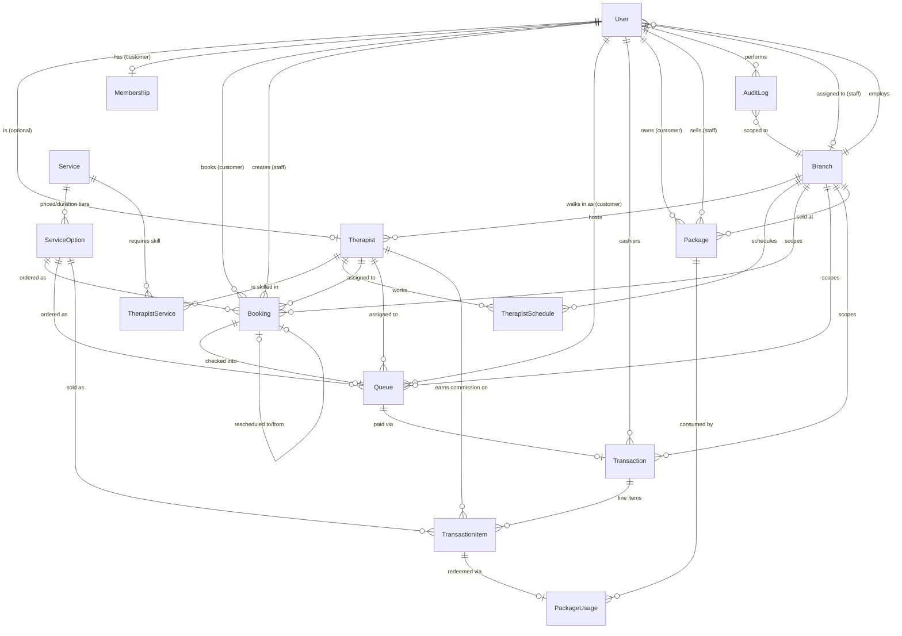

# Phase 1 — ER Diagram & Data Flow

## ER Diagram



## เอนทิตีหลักและความสัมพันธ์

- **User** — ตัวตนสำหรับ login เดียวสำหรับทุก role (`OWNER / STAFF / THERAPIST / CUSTOMER`)
  รองรับทั้ง email+password (เจ้าของ/พนักงาน) และ LINE Login (`lineUserId`, ลูกค้า) ในฟิลด์เดียวกัน —
  Phase 2 จะต่อ NextAuth เข้ากับโมเดลนี้โดยไม่ต้องแก้ schema ส่วนนี้
- **Branch** — สาขาร้าน ทุกข้อมูล operational (booking / queue / transaction / package) ผูกกับสาขาเสมอ
- **Service → ServiceOption** — แยก "บริการ" (เช่น นวดแผนไทย) ออกจาก "ตัวเลือกระยะเวลา/ราคา"
  (60/90/120 นาที) เพราะ 1 บริการมักขายได้หลายระยะเวลา คนละราคา ตรงกับ flow การจองใน Phase 3
- **Therapist** — ผูกกับ `Branch` เดียว (ตัดสินใจให้ทันสมัยที่สุดสำหรับ Phase 1: หมอนวด 1 คนทำงาน
  สาขาเดียว) และผูกกับ `User` แบบ optional 1:1 (เพิ่มโปรไฟล์หมอนวดก่อนสร้าง login ได้)
- **TherapistService** — ตารางกลาง (ความถนัด) ยังเก็บ commission override เฉพาะบริการได้ด้วย
- **TherapistSchedule** — เก็บเป็น "วันที่จริง" ไม่ใช่ template รายสัปดาห์ เพื่อให้จัดการวันหยุด/ลา
  เฉพาะวันได้ง่าย และ Phase 3 ใช้คำนวณ slot ว่างต่อวันได้ตรงไปตรงมา
- **Booking vs Queue** — แยก 2 ตารางตามที่ตัดสินใจไว้:
  - `Booking` = การจองล่วงหน้า (วัน-เวลา-บริการ-หมอนวด ที่ต้องการ), รองรับ walk-in ไม่ได้เพราะ
    ยังไม่มีคิวจริง
  - `Queue` = คิวปฏิบัติการจริงประจำวัน (รอ/กำลังนวด/เสร็จ, เตียง/ห้อง) เกิดจาก `Booking` ตอน
    เช็คอิน **หรือ** สร้างตรงสำหรับลูกค้า walk-in ที่ไม่มี booking ล่วงหน้าเลย
  - `Booking.rescheduledFromId` เป็น self-relation ใช้ตอนเลื่อนนัด แทนการแก้เวลาทับของเดิม
    (ประวัติเดิมยังอยู่ครบ ตรวจสอบย้อนหลังได้)
- **Transaction → TransactionItem** — ใบเสร็จ 1 ใบมีได้หลายรายการ (POS) แต่ละ `TransactionItem`
  snapshot ราคาต่อหน่วยและอัตราค่ามือหมอนวด ณ เวลาขายไว้ **แยกจาก** `Therapist.commissionRate`
  ปัจจุบัน (hard rule #4) — เปลี่ยนค่ามือในอนาคตจะไม่กระทบยอดค่ามือของรายการที่ขายไปแล้ว
  `Transaction.vatRate` ก็ snapshot ไว้เช่นกัน (ตอนนี้ default 7%)
- **Package → PackageUsage** — `Package` คือคอร์สที่ลูกค้าซื้อไปแล้ว (เก็บ `remainingSessions`),
  `PackageUsage` คือ ledger การตัดครั้งแบบ append-only (ห้าม update/delete) หนึ่งแถวต่อหนึ่งครั้งที่ใช้
  ดูหัวข้อ "การตัดคอร์สแบบ atomic" ด้านล่าง
- **Membership** — แยกออกจาก `User` โดยตั้งใจ เพื่อให้ concern เรื่อง auth/identity กับ
  concern เรื่อง loyalty program (แต้ม/ระดับสมาชิก) ไม่ผูกกัน แก้ไขคนละส่วนได้อิสระ
- **AuditLog** — append-only, เก็บ actor + **snapshot role ของ actor ณ เวลานั้น** + entityType/Id +
  `beforeData`/`afterData` (jsonb) ครอบคลุมทุก transaction การเงินและการแก้ไขคิว/booking

## Data flow หลัก

### 1. จองคิว (Phase 3)
`Service` → เลือก `ServiceOption` (ระยะเวลา) → เลือก `Therapist` หรือ "คนไหนก็ได้" (`therapistId = null`)
→ เลือกวัน-เวลาว่างจาก `TherapistSchedule` ที่ยังไม่ชนกับ `Booking` เดิม (คำนวณจาก
`Booking.startTime/endTime` ที่ยัง active) → สร้าง `Booking` (status `PENDING`/`CONFIRMED`)
ฐานข้อมูลกัน double-booking ให้อัตโนมัติด้วย PostgreSQL `EXCLUDE` constraint (ดูหัวข้อถัดไป)
แม้แอปจะมี bug หรือมี concurrent request ก็ตาม

### 2. เช็คอิน → คิวจริง (Phase 4)
ลูกค้ามาถึงร้าน → staff เช็คอิน `Booking` → ระบบสร้าง `Queue` แถวใหม่ผูกกับ `booking.id`
(สำหรับ walk-in ไม่มี booking ก็สร้าง `Queue` ตรงได้เลย โดย `bookingId = null`) → อัปเดตสถานะ
`WAITING → ASSIGNED → IN_PROGRESS → DONE` พร้อม assign หมอนวด/เตียง

### 3. ชำระเงิน (Phase 6)
`Queue` เสร็จงาน → เปิด `Transaction` ผูกกับ `queue.id` → เพิ่ม `TransactionItem` ต่อบริการ/หมอนวด
(snapshot ราคา + commission ตามที่อธิบายด้านบน) → คำนวณ `subtotal/vatAmount/totalAmount` → บันทึก
`AuditLog` (action `CREATE`/`VOID`/`REFUND`)

### 4. ตัดคอร์ส/แพ็กเกจแบบ atomic (Phase 7)
เมื่อลูกค้าจ่ายด้วยคอร์สแทนเงินสด: ระบบต้อง (ก) ลด `Package.remainingSessions -= 1` และ
(ข) สร้างแถว `PackageUsage` ใหม่ **ในทรานแซกชันฐานข้อมูลเดียวกัน** (`prisma.$transaction`) เท่านั้น
ห้ามทำสองขั้นตอนนี้แยกกัน เพราะถ้าล้มเหลวระหว่างกลางจะทำให้ยอดคงเหลือกับ ledger ไม่ตรงกัน
Phase 7 จะ implement เป็น interactive transaction ที่ `SELECT ... FOR UPDATE` แถว `Package` ก่อน
ลดจำนวน เพื่อกันแข่งกันตัดคอร์สพร้อมกัน (concurrent redemption) ด้วย

## กัน double-booking ที่ระดับฐานข้อมูล (hard rule #6)

Prisma schema DSL ไม่มีทางประกาศ PostgreSQL `EXCLUDE` constraint ได้ตรงๆ จึงต้องเขียน raw SQL
ต่อท้าย migration (`prisma/migrations/20260701061535_init/migration.sql`):

```sql
CREATE EXTENSION IF NOT EXISTS btree_gist;

ALTER TABLE "bookings" ADD CONSTRAINT "bookings_no_therapist_overlap"
  EXCLUDE USING gist (
    "therapist_id" WITH =,
    tsrange("start_time", "end_time", '[)') WITH &&
  )
  WHERE (
    "therapist_id" IS NOT NULL
    AND "deleted_at" IS NULL
    AND "status" NOT IN ('CANCELLED', 'NO_SHOW', 'RESCHEDULED')
  );
```

Constraint นี้ทำให้ธอมนวดคนเดียวกันมีสองการจองที่เวลาทับกันไม่ได้ **ไม่ว่าแอปจะมี race condition
หรือไม่ก็ตาม** — ทดสอบแล้วว่า insert ที่เวลาทับกันจะถูก Postgres ปฏิเสธด้วย
`conflicting key value violates exclusion constraint`

## ข้อสมมติฐาน/การตัดสินใจที่ทำแทน (โปรดตรวจทาน)

พยายามถามก่อนตัดสินใจสำคัญตามที่ตกลงไว้ แต่เครื่องมือถามคำถามใช้งานไม่ได้ในรอบนี้ จึงตัดสินใจ
เป็น default ที่สมเหตุสมผลที่สุดสำหรับร้านนวด SME ทั่วไปในไทย ถ้าอยากเปลี่ยนแจ้งได้เลย ยังแก้ไม่ยาก
เพราะยังไม่มีข้อมูลจริงในระบบ:

1. **Booking กับ Queue แยกตาราง** (ไม่รวมเป็นตารางเดียว) — เพราะ walk-in ต้องมีคิวได้โดยไม่ต้องผ่าน
   การจองล่วงหน้า และหน้า "สถานะคิว" ของลูกค้า (Phase 3) กับ dashboard คิว realtime (Phase 4)
   มี lifecycle ต่างจาก booking ล่วงหน้าชัดเจน
2. **หมอนวด 1 คน ผูกกับ 1 สาขา** — ง่ายต่อการคำนวณตารางเวรและค่ามือ ตรงกับร้านนวดส่วนใหญ่ใน
   ไทยที่หมอนวดประจำสาขา ถ้าร้านมีหมอนวดหมุนเวียนหลายสาขาจริง ค่อยเพิ่ม join table
   `TherapistBranch` ทีหลังได้โดยไม่กระทบโครงสร้างอื่น
3. **Service/ServiceOption เป็น catalog กลาง ไม่ผูกสาขา** — ราคามาตรฐานเดียวกันทุกสาขา
   (Phase 8 ถ้าต้องการราคาต่างกันตามสาขา ค่อยเพิ่มตาราง override `BranchServicePrice` ทีหลัง)
4. **เงิน**: เลือกใช้ `Decimal @db.Decimal(10,2)` หน่วยบาท (ไม่ใช้หน่วยสตางค์เป็น integer) — อ่าน/
   debug ง่ายกว่า และกฎห้าม float ก็ยังคงเป็นไปตามนั้น (Decimal เป็นหนึ่งในสองตัวเลือกที่อนุญาต)
5. **Prisma 7 + driver adapter**: เวอร์ชัน Prisma ที่ติดตั้งได้ในสภาพแวดล้อมนี้ (7.8.0) เปลี่ยน
   สถาปัตยกรรมจาก query-engine binary เป็น "driver adapter" (`@prisma/adapter-pg` + `pg`) —
   ต้องสร้าง `PrismaClient` พร้อม adapter เสมอ (ดู `src/lib/prisma.ts`) เชื่อมต่อฐานข้อมูลจริง
   (runtime) ผ่าน `DATABASE_URL` (pooled/PgBouncer) ส่วน Prisma CLI (migrate/studio) ใช้
   `DIRECT_URL` (direct connection) ตามที่กำหนดใน `prisma.config.ts`

## การเชื่อมต่อ Supabase (production)

ตั้งค่าใน `.env` (ดู `.env.example`):

- `DATABASE_URL` — pooled connection ผ่าน Supabase PgBouncer (พอร์ต 6543, `pgbouncer=true`)
  ใช้โดยแอป Next.js ตอน runtime (เหมาะกับ serverless ที่เปิด connection สั้นๆ จำนวนมาก)
- `DIRECT_URL` — direct connection (พอร์ต 5432) ใช้โดย Prisma CLI ตอนรัน `migrate`/`studio`
  เท่านั้น (PgBouncer โหมด transaction ไม่รองรับ DDL/prepared statements ที่ migration ต้องใช้)

รันคำสั่งเหล่านี้เพื่อ setup ฐานข้อมูลจริงบน Supabase:

```bash
npx prisma migrate deploy   # apply migrations ทั้งหมดแบบ production-safe
npm run db:seed             # ใส่ seed data ตัวอย่าง (ปรับ/ลบตามจริงก่อนใช้งานจริง)
```

## Phase 2 — Auth & Roles

ใช้ **NextAuth v4** (`next-auth@4`, เสถียรและรองรับ Next.js 14 App Router ชัดเจนกว่า v5 ที่ยังเป็น
beta) session แบบ **JWT** (ไม่ใช้ database session) — ตัดสินใจ **ไม่เพิ่มตาราง** `Account` /
`Session` / `VerificationToken` ของ NextAuth Prisma Adapter เข้า schema เพราะ:

- Credentials provider (email+password) ของ NextAuth ใช้ร่วมกับ database adapter ไม่ได้อยู่แล้ว
  (ต้องใช้ JWT strategy เท่านั้น) — ทำให้การมีสองแบบผสมกันไม่มีประโยชน์
- โมเดล `User` ใน Phase 1 มีฟิลด์ที่จำเป็นครบอยู่แล้ว (`email`, `passwordHash`, `lineUserId`) จึงผูก
  ตรงกับ NextAuth ได้โดยไม่ต้องมีตารางกลางเพิ่ม ลด surface area ของ schema ตรงตามหลัก
  "ไม่เพิ่ม abstraction เกินความจำเป็น"
- Session แบบ JWT ไม่ต้อง query DB ทุก request → เหมาะกับงบ serverless ~$2-4 USD/เดือน

**Provider ที่ใช้:**

- `CredentialsProvider` (id `credentials`) — สำหรับ `OWNER` / `STAFF` / `THERAPIST` เท่านั้น
  (ตรวจ role ใน `authorize()`) เทียบรหัสผ่านด้วย `bcryptjs` กับ `User.passwordHash`
- `LineProvider` — สำหรับ `CUSTOMER` เท่านั้น ใน `signIn` callback จะ find-or-create แถว `User`
  (role `CUSTOMER`) จาก `lineUserId` พร้อมสร้าง `Membership` ให้อัตโนมัติถ้ายังไม่มี

**Middleware** (`src/middleware.ts`) ป้องกัน 3 กลุ่ม route ด้วย `next-auth/middleware`:
`/dashboard/**` (OWNER/STAFF), `/therapist/**` (THERAPIST), `/account/**` (CUSTOMER) — role ไหน
เข้าโซนที่ไม่ใช่ของตัวเองจะถูก redirect ไป `/login` ทดสอบแล้วด้วย curl จริง (ดู PR) ครอบคลุม: ไม่ login
→ redirect, login ผิด role → redirect, login ถูก role → 200, รหัสผ่านผิด → 401

**ข้อจำกัดที่รู้ตัว (ยอมรับได้ใน Phase 2, ไม่ over-engineer ตอนนี้):** เพราะเป็น JWT session
การ deactivate (`isActive=false`) หรือเปลี่ยน role ของ user จะไม่มีผลจนกว่า token จะหมดอายุ/มีการ
login ใหม่ (default 30 วัน) — ถ้าต้องการ revoke ทันที ค่อยเพิ่ม mechanism (เช่น เช็ค `isActive`
ใน middleware ทุก request หรือย่อ token maxAge) ในเฟสที่เกี่ยวข้องกับความปลอดภัยจริงจังขึ้น

**Demo credentials** (จาก `prisma/seed.ts`, ใช้ทดสอบเท่านั้น ห้ามใช้ค่านี้ใน production):
`owner@massageshop.test` / `staff@massageshop.test` / `nok@massageshop.test` /
`waew@massageshop.test` / `oi@massageshop.test` — รหัสผ่านเดียวกันหมด `Password123!`

## Phase 3 — ระบบจองคิว (Customer)

**สถาปัตยกรรม:** `src/lib/availability.ts` เป็นแกนกลางคำนวณ slot ว่างทั้งหมด อ่านจาก
`TherapistSchedule` (วันทำงานจริงของหมอนวด) ลบด้วยช่วงเวลาที่ถูกจองแล้ว (`Booking` สถานะ
PENDING/CONFIRMED) แล้ว generate ช่อง 30 นาที ที่เว้นระยะล่วงหน้าอย่างน้อย 1 ชั่วโมงจากเวลาปัจจุบัน
ไฟล์นี้ถูกเรียกทั้งจาก Route Handler (`/api/availability` ให้ UI fetch มาแสดง) และจาก server action
ตอนสร้าง/เลื่อนการจอง (เพื่อ validate ซ้ำก่อนเขียนจริง)

**"คนไหนก็ได้" ถูก assign ทันทีตอนจอง ไม่ปล่อยว่างไว้** — เดิมคิดว่า `Booking.therapistId = null`
จะหมายถึง "ยังไม่ระบุ รอ staff มา assign" แต่พบว่าถ้าปล่อย null จริง จะไม่มีอะไรป้องกันการจองเกิน
ความจุของสาขา เพราะ EXCLUDE constraint (hard rule #6) เช็คเฉพาะแถวที่ `therapist_id IS NOT NULL`
เท่านั้น จึงเปลี่ยนมาให้ `findAvailableTherapist()` เลือกหมอนวดที่ว่างจริงให้ทันทีตอนยืนยันจอง
(ทั้งกรณีลูกค้าระบุคนที่ต้องการ และกรณี "คนไหนก็ได้") ทำให้ทุก booking ที่ยืนยันแล้วมี therapist_id
จริงเสมอ และพึ่งพา DB constraint ได้เต็มที่ — `therapistId` ในสกีมายังเป็น nullable ไว้เผื่อ
edge case ในอนาคต แต่ flow ปกติของ Phase 3 จะไม่ปล่อยว่าง

**การจัดการ race condition แบบ 2 ชั้น:** (1) เช็ค availability ในแอปก่อนเขียน DB (UX ที่ดี ตอบเร็ว)
(2) ถ้าสอง request ชนกันจริง (สอง client ยืนยันพร้อมกันภายในหน้าต่างเวลาแคบมาก) DB EXCLUDE
constraint จะ reject การ insert ที่สอง ด้วย SQLSTATE `23P01` — โค้ดจับ error นี้ผ่าน
`isDriverAdapterError()` จาก `@prisma/driver-adapter-utils` (ตรวจเจอจริงว่า error ที่ Postgres
โยนกลับมาไม่ใช่ `PrismaClientKnownRequestError` ตามที่คาดตอนแรก แต่เป็น `DriverAdapterError`
เพราะเป็น constraint ที่ Prisma ไม่รู้จักเอง) แล้วแปลงเป็นข้อความไทยที่เป็นมิตร แทนที่จะ error 500
**ทดสอบแล้วจริงด้วย concurrent request สองอันพร้อมกัน (Playwright, สองหมอนวดคนเดียวกัน
ช่วงเวลาเดียวกัน) ยืนยันว่ามีแค่ 1 booking ที่สำเร็จ อีกอันได้ error message ไม่ crash**

**เลื่อนนัด (reschedule)** สร้าง `Booking` แถวใหม่เชื่อมกับแถวเดิมผ่าน `rescheduledFromId`,
เปลี่ยนสถานะแถวเดิมเป็น `RESCHEDULED` (ไม่ใช่ `CANCELLED`) เพื่อแยกความแตกต่างจากการยกเลิกจริง
พยายามคงหมอนวดคนเดิมไว้ก่อน (ไม่สลับคนอัตโนมัติ) ถ้าคนเดิมไม่ว่างช่วงใหม่ ให้ลูกค้าเลือกเวลาอื่น

**"realtime" ใน Phase 3 = fetch สดทุกครั้งที่เปลี่ยนตัวเลือก** ไม่ใช่ WebSocket/Supabase Realtime
push — เพียงพอสำหรับฟอร์มจองที่ผู้ใช้เลือกแล้วค่อยดูผลลัพธ์ (ไม่ได้เฝ้าหน้าจอรอ) ส่วน Supabase
Realtime ตามที่ระบุใน tech stack จะใช้จริงจังใน Phase 4 (dashboard คิว realtime ที่ staff เฝ้าหน้าจอ
ทั้งวัน ซึ่งคุ้มค่ากว่ามากที่จะ push แทน poll)

**หน้าสถานะคิว (`/account`)** แสดงรายการ `Booking` ของลูกค้าพร้อมสถานะ และซ้อนสถานะ `Queue`
ทับได้ถ้ามีการเช็คอินแล้ว (Phase 4 จะเป็นคนสร้างแถว `Queue`) — ตอนนี้ยังไม่มี flow เช็คอิน จึงจะเห็น
แค่สถานะ booking (ยืนยันแล้ว/ยกเลิกแล้ว/เลื่อนนัดแล้ว) เวลารอจริงจะปรากฏหลัง Phase 4 เสร็จ

## Phase 4 — ระบบจัดการคิว (Admin)

**`/dashboard`** (OWNER/STAFF เท่านั้น, STAFF ถูกจำกัดเฉพาะสาขาตัวเองผ่าน `session.user.branchId`,
OWNER เห็นทุกสาขาและสลับได้ด้วย branch switcher) มี 3 ส่วน: (1) รายการจองวันนี้ที่ยังไม่เช็คอิน
(2) ฟอร์มเพิ่มคิว walk-in (3) คิววันนี้ทั้งหมดพร้อมปุ่มเปลี่ยนสถานะตามหน้างานจริง

**Queue lifecycle**: `WAITING → ASSIGNED → IN_PROGRESS → DONE` (หรือ `CANCELLED` จากสถานะ active
ใดก็ได้) — สถานะเริ่มต้นขึ้นกับว่ามีหมอนวดที่ระบุไว้แล้วหรือยัง:
- เช็คอินจาก `Booking` ที่จองผ่าน `/book` มา จะมี `therapistId` อยู่แล้วเสมอ (ตามการตัดสินใจ Phase 3
  ที่ auto-assign ตอนจอง) → เริ่มที่ `ASSIGNED` ทันที
- เพิ่ม walk-in โดยไม่เลือกหมอนวด (staff ปล่อยให้ "มอบหมายทีหลัง") → เริ่มที่ `WAITING` แล้วให้ staff
  กด "มอบหมาย" เลือกหมอนวดจาก dashboard ทีหลัง

**กันหมอนวดชนคิวตัวเอง (`isTherapistBusy`)**: ต่างจาก `Booking` ที่กันด้วย DB `EXCLUDE` constraint
(เวลาจองล่วงหน้าแบบมีช่วงเวลาชัดเจน) `Queue` ไม่มีแนวคิด time range — จึงกันด้วย business rule แทน:
ห้ามมอบหมาย/เริ่มนวดให้หมอนวดที่มีคิวอื่นสถานะ `IN_PROGRESS` อยู่แล้ว (ตรวจทั้งฝั่ง UI คือ disable
ตัวเลือกในหน้า assign และฝั่ง server action ทุกจุดที่ set therapistId) **ทดสอบแล้วจริง**: ลองเพิ่ม
walk-in ระบุหมอนวดที่กำลังนวดคนอื่นอยู่ ถูก reject ด้วยข้อความ "หมอนวดคนนี้กำลังนวดลูกค้าคนอื่นอยู่"
โดยไม่มีคิวใหม่ถูกสร้างขึ้น

**สถานะเตียง**: ใช้ฟิลด์ `Queue.bedLabel` ที่มีอยู่แล้วตั้งแต่ Phase 1 (ไม่ต้องเพิ่มโมเดล `Bed` ใหม่)
staff กรอกตอนกด "เริ่มนวด" แสดงผลบนการ์ดคิวนั้นเลย

**เช็คเอาท์** (`completeService`) นอกจากปิดคิวเป็น `DONE` แล้ว ยังอัปเดต `Booking.status = COMPLETED`
ของ booking ที่ผูกมาด้วย (ถ้ามี) ให้ลูกค้าเห็นสถานะที่ถูกต้องในหน้า `/account` โดยไม่ต้องรอ Phase 6

**Supabase Realtime** (`src/app/dashboard/queue-realtime-listener.tsx`): subscribe
`postgres_changes` บนตาราง `queues` กรองด้วย `branch_id`, เรียก `router.refresh()` เมื่อมีการ
เปลี่ยนแปลง (ให้ staff อีกคนเห็นการเปลี่ยนแปลงของกันและกันแบบ live โดยไม่ต้อง reload) ทำงานเฉพาะเมื่อ
ตั้งค่า `NEXT_PUBLIC_SUPABASE_URL`/`NEXT_PUBLIC_SUPABASE_ANON_KEY` จริง — ถ้าไม่ตั้งค่า (เช่นตอน dev
ด้วย local Postgres แบบตอนนี้) จะ no-op เงียบๆ ดีบอร์ดยังใช้งานได้ปกติแค่ไม่เห็นการเปลี่ยนแปลงของ
คนอื่นแบบ live เท่านั้น (ต้อง manual refresh หรือรอ action ของตัวเองที่ revalidate อยู่แล้ว)

**Production setup ที่ต้องทำเองบน Supabase project จริง** (ทำผ่าน SQL editor ของ Supabase
dashboard ไม่ใช่ Prisma migration เพราะ `supabase_realtime` publication เป็นของเฉพาะ Supabase-hosted
Postgres ไม่มีใน local Postgres ธรรมดา รัน migration แบบพกพาไม่ได้ถ้าใส่ไว้ใน migration file):

```sql
alter publication supabase_realtime add table queues;
```

## Phase 5 — จัดการหมอนวด & บริการ

**สิทธิ์**: OWNER และ STAFF จัดการหมอนวด/บริการได้เท่ากัน (ไม่ได้แยกสิทธิ์ระดับ field เช่น
"STAFF แก้ค่ามือไม่ได้" — ตัดสินใจให้สอดคล้องกับ Phase 4 ที่ OWNER/STAFF มีสิทธิ์เท่ากันบน
`/dashboard` อยู่แล้ว ไม่อยากเพิ่ม permission tier ใหม่ที่ไม่มีที่ไหนในระบบใช้อยู่ก่อน) หมอนวดยังคง
ผูกกับสาขาเดียวตาม Phase 1 (STAFF จัดการได้เฉพาะสาขาตัวเอง), บริการเป็น catalog กลางไม่ผูกสาขา
จึงไม่มีการเช็ค branch สำหรับ service actions

**"ลบ" หมอนวด/บริการ = ปิดใช้งาน ไม่ใช่ hard delete**: ไม่มีปุ่ม "ลบ" จริงใน UI เลย — หมอนวดใช้
`status` (`ACTIVE`/`ON_LEAVE`/`INACTIVE`) และบริการ/ตัวเลือกใช้ `isActive` ที่มีอยู่แล้วตั้งแต่
Phase 1 แทน สอดคล้องกับ hard rule #2 และป้องกันข้อมูลสูญหายโดยไม่ตั้งใจ (แถวยังอยู่ครบสำหรับ
ประวัติ transaction เก่าที่อ้างถึง)

**Rating เป็น read-only**: `Therapist.ratingAverage`/`ratingCount` ยังไม่มีกลไกเก็บคะแนนจริง
(ไม่มี `Review` model ใน scope ปัจจุบัน) จึงแสดงผลอย่างเดียวในหน้า list ("ยังไม่มี" เมื่อ count = 0)
ไม่เปิดให้แก้ไขค่าตรงๆ เพราะจะเป็นข้อมูลปลอมที่ไม่ได้มาจากลูกค้าจริง — ถ้าต้องการ ต้องเพิ่ม
`Review` model + flow ให้ลูกค้าให้คะแนนหลังใช้บริการในเฟสถัดไป

**โปรโมชั่น**: เพิ่มแค่ฟิลด์ `ServiceOption.promoPrice` (nullable, migration
`20260701075446_add_service_option_promo_price`) แทนที่จะสร้างโมเดล `Promotion` แยก — ไม่มี
กำหนดวันเริ่ม/สิ้นสุดหรือเงื่อนไขอื่น staff เปิด/ปิดโปรโมชั่นเองด้วยมือผ่านการใส่/ลบราคาโปรโมชั่น
ถ้าต้องการโปรโมชั่นแบบมีกำหนดเวลา/เงื่อนไขซับซ้อนกว่านี้ ค่อยขยายเป็นโมเดลแยกทีหลัง ราคาโปรโมชั่น
แสดงผลแล้วทั้งใน `/book` (ฝั่งลูกค้า), หน้าเพิ่มคิว walk-in, และหน้า list บริการ

**`src/lib/staff-auth.ts` / `src/lib/branch-scope.ts`**: ดึง logic การเช็คสิทธิ์ staff/branch และ
การ resolve สาขาที่ active ออกมาเป็น helper กลาง (ใช้ซ้ำระหว่าง `/dashboard`,
`/dashboard/therapists`, และ Phase 4's `dashboard/actions.ts` ที่ refactor มาใช้ helper เดียวกัน)

**ตารางเวร** (`/dashboard/therapists/[id]/schedule`) แสดง 14 วันข้างหน้า แต่ละวัน save แยกเป็น
แถวอิสระ (ไม่ต้อง submit ทีเดียวทั้งหมด) upsert ลง `TherapistSchedule` ตรงๆ ตาม unique constraint
`(therapistId, date)` ที่มีอยู่แล้วตั้งแต่ Phase 1

## Phase 6 — POS & ชำระเงิน

**Flow หลัก**: Phase 4 ทำให้ `Queue` จบงานเป็น `DONE`, Phase 6 มา "ชำระเงิน" ให้คิวนั้น — หน้า
`/dashboard/pos` แสดงรายการคิว `DONE` ที่ยังไม่มี `Transaction` ผูกอยู่ (`transaction: null` — ใช้
ความสัมพันธ์ 1:1 optional ที่ออกแบบไว้ตั้งแต่ Phase 1) กด "ชำระเงิน" ไปที่
`/dashboard/pos/new?queueId=X` ซึ่ง pre-fill รายการแรกจากบริการ/หมอนวดของคิวนั้น แคชเชียร์เพิ่ม
รายการอื่นได้ (เช่น ขายเพิ่ม/แถม) ก่อนกดรับชำระ **กันจ่ายซ้ำ**: `Transaction.queueId` เป็น
`@unique` อยู่แล้ว + เช็คซ้ำใน action ก่อน insert ด้วย (ทดสอบแล้วว่าเปิดหน้าชำระเงินซ้ำสำหรับคิว
ที่จ่ายไปแล้วจะ redirect ไปใบเสร็จเดิมแทนที่จะให้จ่ายซ้ำ)

**ห้ามเชื่อราคาจาก client เด็ดขาด**: ฝั่ง client คำนวณ subtotal/VAT/total แค่เพื่อแสดงผลแบบ
real-time เท่านั้น — ตอน submit จริง server action (`createTransaction`) ดึงราคาปัจจุบัน
(`ServiceOption.promoPrice ?? price`) จาก DB ใหม่ทุกครั้งด้วยตัวเอง ไม่ใช้ตัวเลขที่ client ส่งมาเลย
ป้องกันการปลอมแปลงราคาผ่าน devtools/network request

**ค่ามือหมอนวด** (`src/lib/commission.ts`): resolve `commissionType`/`commissionRate` จาก
`Therapist` เป็นค่าเริ่มต้น แต่เช็ค `TherapistService.commissionRateOverride` ก่อนเสมอ (ถ้ามี
override เฉพาะบริการนั้นจะใช้ค่านั้นแทน) คำนวณ `commissionAmount` แล้ว snapshot ทั้งสามค่าลง
`TransactionItem` ทันที (hard rule #4) — ถ้าค่ามือของหมอนวดถูกแก้ในอนาคต (ผ่าน Phase 5) จะไม่กระทบ
ยอดค่ามือของรายการที่ขายไปแล้วเลย (ทดสอบแล้วว่าตัวเลขที่บันทึกตรงกับสูตรจริง)

**VAT แบบรวมในราคาอยู่แล้ว (VAT-inclusive)**: ราคาที่ลูกค้าเห็นตอนจอง (`/book`) เป็นราคาสุทธิ
ราคาเดียว ไม่มี "+VAT" โผล่มาทีหลังตอนจ่ายเงินจริง ดังนั้น `totalAmount = subtotal - discount`
(ไม่บวก VAT เพิ่ม) ส่วน `vatAmount` เป็นแค่ตัวเลข breakdown ที่แยกออกมาโชว์บนใบเสร็จเพื่อความถูกต้อง
ทางบัญชี คำนวณจาก `totalAmount * 7 / 107` — เป็นข้อสมมติฐานที่ตัดสินใจแทนเพราะเครื่องมือถามคำถาม
ไม่เสถียร ถ้าร้านจริงต้องการ VAT แบบบวกเพิ่มจากราคาที่ตั้งไว้ (exclusive) ต้องปรับสูตรใน
`src/app/dashboard/pos/actions.ts` (`computeVat`) จุดเดียว

**ยกเลิกใบเสร็จ (void) ไม่ใช่ hard delete**: `Transaction.status` เปลี่ยนเป็น `VOIDED` +
`voidReason` + `voidedAt` เท่านั้น แถวและ `TransactionItem` ทั้งหมดยังอยู่ครบสำหรับตรวจสอบย้อนหลัง
(hard rule #2) ไม่มีปุ่ม "ลบ" ใบเสร็จเลยในทุกกรณี — OWNER/STAFF ยกเลิกได้เท่ากัน (เหตุผลเดียวกับ
Phase 5: ไม่อยากเพิ่ม permission tier ใหม่ที่ไม่มีที่ไหนในระบบใช้อยู่ก่อน) แต่ทุกครั้งที่ยกเลิก
จะบันทึก `actorId`/`actorRole` ไว้ใน `AuditLog` เสมอ ซึ่งเป็นกลไก accountability จริงที่ hard
rule ต้องการ ไม่ใช่การจำกัด role

## Phase 7 — สมาชิก / คอร์ส / CRM

**แก้ช่องโหว่จาก Phase 1**: `Package.serviceId` เป็นแค่ scalar column เฉยๆ มาตั้งแต่ Phase 1
ไม่เคยประกาศ `@relation` จริง ทำให้ไม่มี FK constraint ที่ระดับ DB เลย (bug ที่ค้างมาตั้งแต่ต้น
พบตอนพยายาม query `package.service` ใน Phase 7 นี้เอง) เพิ่ม migration
`20260701090735_add_package_service_relation` ผูก FK ให้ถูกต้อง เป็นตัวอย่างว่าทำไมการรัน
`prisma generate`/`tsc --noEmit` ก่อน commit ทุกครั้งถึงสำคัญ — TypeScript จับ bug นี้ได้ทันทีที่
เริ่มเขียนโค้ด query จริง

**ประวัติลูกค้า (CRM)**: `/dashboard/customers` ค้นหาด้วยชื่อ/เบอร์โทร →
`/dashboard/customers/[id]` แสดงสมาชิก (tier/แต้ม), คอร์สคงเหลือ, ประวัติการจอง, ประวัติการชำระเงิน
ครบในหน้าเดียว — ไม่มี auto tier-upgrade logic (สเปกขอแค่ "ประวัติลูกค้า, แต้มสะสม" ไม่ได้ขอ
ระบบเลื่อนระดับสมาชิกอัตโนมัติ ตัดสินใจไม่ทำเพิ่มเพื่อไม่ over-engineer)

**แต้มสะสม** (`src/lib/loyalty.ts`): อัตราคงที่ 1 แต้มต่อทุก 25 บาทที่ **จ่ายจริง** (ปัดลง) —
รายการที่ตัดจากคอร์สนับเป็น ฿0 จึงไม่ได้แต้ม (ลูกค้าได้แต้มไปแล้วตอนซื้อคอร์สแทน ถ้าจะให้ระบบนับ
แต้มตอนซื้อคอร์สด้วยต้องแก้ `sellPackage` เพิ่ม ยังไม่ทำเพราะสเปกไม่ได้ระบุชัดเจน) ยกเลิกใบเสร็จ
จะคืนแต้มด้วยเสมอ (หักคืนแบบไม่ให้ติดลบ)

**ขายคอร์ส** (`sellPackage`) เป็น action แยกจาก POS/Transaction เดิม — ไม่ได้บังคับให้การขายคอร์ส
ต้องออกใบเสร็จผ่านระบบ POS (schema เดิมของ `TransactionItem` ผูกกับ `ServiceOption` เท่านั้น
ไม่รองรับ `Package` โดยตรง การจะรวมสองระบบต้องแก้ schema เพิ่มซึ่งเกินขอบเขตที่ Phase 7 ขอ) แต่ยัง
ตรงตาม hard rule #3 เพราะเขียน `AuditLog` ทุกครั้งที่ขาย (การเงินที่เกิดขึ้นถูกบันทึกไว้ แค่ไม่มี
ใบเสร็จ POS แบบพิมพ์ได้ — ถ้าต้องการออกใบเสร็จตอนขายคอร์สด้วย ค่อยขยาย schema ในเฟสถัดไป)

**ตัดคอร์สแบบ atomic** (hard rule #5) — ใน `createTransaction`: `tx.package.updateMany({where:
{id, remainingSessions: {gt: 0}}, data: {remainingSessions: {decrement: 1}}})` แล้วเช็ค
`count === 0` เพื่อรู้ว่าโดนแย่งตัดไปก่อน (คนละแนวทางจาก `SELECT ... FOR UPDATE` แต่ atomic
เท่ากัน เพราะ Postgres ล็อกแถวที่ WHERE match ระหว่างทำ UPDATE โดยอัตโนมัติอยู่แล้ว) —
**ทดสอบจริงด้วย concurrent request สองอันแย่งตัดคอร์สที่เหลือครั้งเดียวกันพร้อมกัน** ยืนยันว่า
สำเร็จแค่ 1 รายการ อีกอันได้ error message ที่เป็นมิตร ไม่ crash, `remainingSessions` จบที่ 0 ถูกต้อง

**เจอ bug จริงระหว่างทดสอบ**: `generateReceiptNo()` นับ transaction วันนี้แล้ว +1 — ถ้าสอง
checkout ยิงพร้อมกัน ทั้งคู่จะคำนวณเลขที่ใบเสร็จ**ซ้ำกัน** พอ insert จริงตัวที่สองชนกับ unique
constraint บน `receipt_no` แล้ว throw 500 ดิบๆ ออกมา (ไม่ใช่แค่ทฤษฎี — เจอจริงตอนรัน concurrent
test ข้างบน) แก้ด้วยการ retry สร้างเลขที่ใบเสร็จใหม่สูงสุด 5 ครั้งเมื่อชนกัน (ตรวจจาก
`Prisma.PrismaClientKnownRequestError` code `P2002` — Postgres ไม่ได้คืน `meta.target` เป็น
array ของชื่อ column เหมือน MySQL เสมอไป บางทีเป็นชื่อ constraint แบบ string เฉยๆ เลยต้องเช็ค
ทั้งสองแบบ + fallback เช็คข้อความ error ด้วย) **ทดสอบซ้ำแล้วว่าหลังแก้ ไม่มี 500 อีก** ได้ error
message ที่เป็นมิตรแทน
