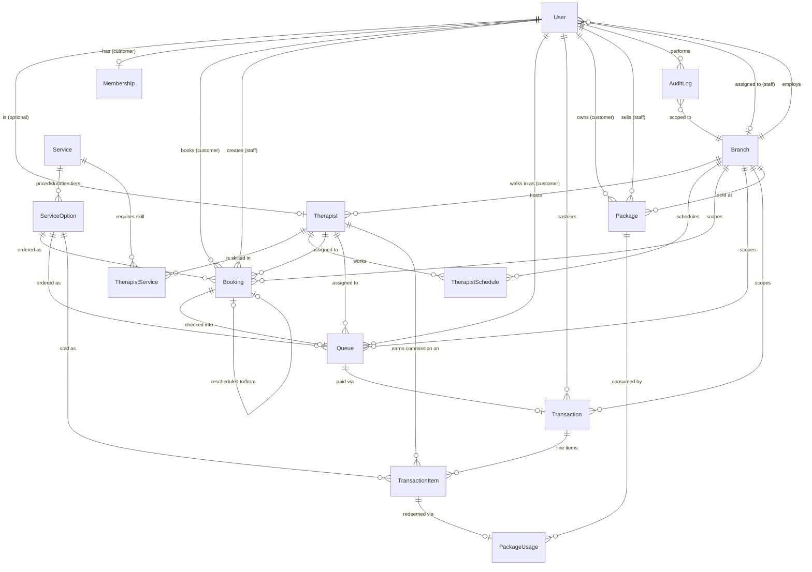

# Phase 1 — ER Diagram & Data Flow

## ER Diagram



## เอนทิตีหลักและความสัมพันธ์

- **User** — ตัวตนสำหรับ login เดียวสำหรับทุก role (`OWNER / STAFF / THERAPIST / CUSTOMER`)
  รองรับทั้ง email+password (เจ้าของ/พนักงาน) และ LINE Login (`lineUserId`, ลูกค้า) ในฟิลด์เดียวกัน —
  Phase 2 จะต่อ NextAuth เข้ากับโมเดลนี้โดยไม่ต้องแก้ schema ส่วนนี้
- **Branch** — สาขาร้าน ทุกข้อมูล operational (booking / queue / transaction / package) ผูกกับสาขาเสมอ
- **Service → ServiceOption** — แยก "บริการ" (เช่น นวดแผนไทย) ออกจาก "ตัวเลือกระยะเวลา/ราคา"
  (60/90/120 นาที) เพราะ 1 บริการมักขายได้หลายระยะเวลา คนละราคา ตรงกับ flow การจองใน Phase 3
- **Therapist** — ผูกกับ `Branch` เดียว (ตัดสินใจให้ทันสมัยที่สุดสำหรับ Phase 1: หมอนวด 1 คนทำงาน
  สาขาเดียว) และผูกกับ `User` แบบ optional 1:1 (เพิ่มโปรไฟล์หมอนวดก่อนสร้าง login ได้)
- **TherapistService** — ตารางกลาง (ความถนัด) ยังเก็บ commission override เฉพาะบริการได้ด้วย
- **TherapistSchedule** — เก็บเป็น "วันที่จริง" ไม่ใช่ template รายสัปดาห์ เพื่อให้จัดการวันหยุด/ลา
  เฉพาะวันได้ง่าย และ Phase 3 ใช้คำนวณ slot ว่างต่อวันได้ตรงไปตรงมา
- **Booking vs Queue** — แยก 2 ตารางตามที่ตัดสินใจไว้:
  - `Booking` = การจองล่วงหน้า (วัน-เวลา-บริการ-หมอนวด ที่ต้องการ), รองรับ walk-in ไม่ได้เพราะ
    ยังไม่มีคิวจริง
  - `Queue` = คิวปฏิบัติการจริงประจำวัน (รอ/กำลังนวด/เสร็จ, เตียง/ห้อง) เกิดจาก `Booking` ตอน
    เช็คอิน **หรือ** สร้างตรงสำหรับลูกค้า walk-in ที่ไม่มี booking ล่วงหน้าเลย
  - `Booking.rescheduledFromId` เป็น self-relation ใช้ตอนเลื่อนนัด แทนการแก้เวลาทับของเดิม
    (ประวัติเดิมยังอยู่ครบ ตรวจสอบย้อนหลังได้)
- **Transaction → TransactionItem** — ใบเสร็จ 1 ใบมีได้หลายรายการ (POS) แต่ละ `TransactionItem`
  snapshot ราคาต่อหน่วยและอัตราค่ามือหมอนวด ณ เวลาขายไว้ **แยกจาก** `Therapist.commissionRate`
  ปัจจุบัน (hard rule #4) — เปลี่ยนค่ามือในอนาคตจะไม่กระทบยอดค่ามือของรายการที่ขายไปแล้ว
  `Transaction.vatRate` ก็ snapshot ไว้เช่นกัน (ตอนนี้ default 7%)
- **Package → PackageUsage** — `Package` คือคอร์สที่ลูกค้าซื้อไปแล้ว (เก็บ `remainingSessions`),
  `PackageUsage` คือ ledger การตัดครั้งแบบ append-only (ห้าม update/delete) หนึ่งแถวต่อหนึ่งครั้งที่ใช้
  ดูหัวข้อ "การตัดคอร์สแบบ atomic" ด้านล่าง
- **Membership** — แยกออกจาก `User` โดยตั้งใจ เพื่อให้ concern เรื่อง auth/identity กับ
  concern เรื่อง loyalty program (แต้ม/ระดับสมาชิก) ไม่ผูกกัน แก้ไขคนละส่วนได้อิสระ
- **AuditLog** — append-only, เก็บ actor + **snapshot role ของ actor ณ เวลานั้น** + entityType/Id +
  `beforeData`/`afterData` (jsonb) ครอบคลุมทุก transaction การเงินและการแก้ไขคิว/booking

## Data flow หลัก

### 1. จองคิว (Phase 3)
`Service` → เลือก `ServiceOption` (ระยะเวลา) → เลือก `Therapist` หรือ "คนไหนก็ได้" (`therapistId = null`)
→ เลือกวัน-เวลาว่างจาก `TherapistSchedule` ที่ยังไม่ชนกับ `Booking` เดิม (คำนวณจาก
`Booking.startTime/endTime` ที่ยัง active) → สร้าง `Booking` (status `PENDING`/`CONFIRMED`)
ฐานข้อมูลกัน double-booking ให้อัตโนมัติด้วย PostgreSQL `EXCLUDE` constraint (ดูหัวข้อถัดไป)
แม้แอปจะมี bug หรือมี concurrent request ก็ตาม

### 2. เช็คอิน → คิวจริง (Phase 4)
ลูกค้ามาถึงร้าน → staff เช็คอิน `Booking` → ระบบสร้าง `Queue` แถวใหม่ผูกกับ `booking.id`
(สำหรับ walk-in ไม่มี booking ก็สร้าง `Queue` ตรงได้เลย โดย `bookingId = null`) → อัปเดตสถานะ
`WAITING → ASSIGNED → IN_PROGRESS → DONE` พร้อม assign หมอนวด/เตียง

### 3. ชำระเงิน (Phase 6)
`Queue` เสร็จงาน → เปิด `Transaction` ผูกกับ `queue.id` → เพิ่ม `TransactionItem` ต่อบริการ/หมอนวด
(snapshot ราคา + commission ตามที่อธิบายด้านบน) → คำนวณ `subtotal/vatAmount/totalAmount` → บันทึก
`AuditLog` (action `CREATE`/`VOID`/`REFUND`)

### 4. ตัดคอร์ส/แพ็กเกจแบบ atomic (Phase 7)
เมื่อลูกค้าจ่ายด้วยคอร์สแทนเงินสด: ระบบต้อง (ก) ลด `Package.remainingSessions -= 1` และ
(ข) สร้างแถว `PackageUsage` ใหม่ **ในทรานแซกชันฐานข้อมูลเดียวกัน** (`prisma.$transaction`) เท่านั้น
ห้ามทำสองขั้นตอนนี้แยกกัน เพราะถ้าล้มเหลวระหว่างกลางจะทำให้ยอดคงเหลือกับ ledger ไม่ตรงกัน
Phase 7 จะ implement เป็น interactive transaction ที่ `SELECT ... FOR UPDATE` แถว `Package` ก่อน
ลดจำนวน เพื่อกันแข่งกันตัดคอร์สพร้อมกัน (concurrent redemption) ด้วย

## กัน double-booking ที่ระดับฐานข้อมูล (hard rule #6)

Prisma schema DSL ไม่มีทางประกาศ PostgreSQL `EXCLUDE` constraint ได้ตรงๆ จึงต้องเขียน raw SQL
ต่อท้าย migration (`prisma/migrations/20260701061535_init/migration.sql`):

```sql
CREATE EXTENSION IF NOT EXISTS btree_gist;

ALTER TABLE "bookings" ADD CONSTRAINT "bookings_no_therapist_overlap"
  EXCLUDE USING gist (
    "therapist_id" WITH =,
    tsrange("start_time", "end_time", '[)') WITH &&
  )
  WHERE (
    "therapist_id" IS NOT NULL
    AND "deleted_at" IS NULL
    AND "status" NOT IN ('CANCELLED', 'NO_SHOW', 'RESCHEDULED')
  );
```

Constraint นี้ทำให้ธอมนวดคนเดียวกันมีสองการจองที่เวลาทับกันไม่ได้ **ไม่ว่าแอปจะมี race condition
หรือไม่ก็ตาม** — ทดสอบแล้วว่า insert ที่เวลาทับกันจะถูก Postgres ปฏิเสธด้วย
`conflicting key value violates exclusion constraint`

## ข้อสมมติฐาน/การตัดสินใจที่ทำแทน (โปรดตรวจทาน)

พยายามถามก่อนตัดสินใจสำคัญตามที่ตกลงไว้ แต่เครื่องมือถามคำถามใช้งานไม่ได้ในรอบนี้ จึงตัดสินใจ
เป็น default ที่สมเหตุสมผลที่สุดสำหรับร้านนวด SME ทั่วไปในไทย ถ้าอยากเปลี่ยนแจ้งได้เลย ยังแก้ไม่ยาก
เพราะยังไม่มีข้อมูลจริงในระบบ:

1. **Booking กับ Queue แยกตาราง** (ไม่รวมเป็นตารางเดียว) — เพราะ walk-in ต้องมีคิวได้โดยไม่ต้องผ่าน
   การจองล่วงหน้า และหน้า "สถานะคิว" ของลูกค้า (Phase 3) กับ dashboard คิว realtime (Phase 4)
   มี lifecycle ต่างจาก booking ล่วงหน้าชัดเจน
2. **หมอนวด 1 คน ผูกกับ 1 สาขา** — ง่ายต่อการคำนวณตารางเวรและค่ามือ ตรงกับร้านนวดส่วนใหญ่ใน
   ไทยที่หมอนวดประจำสาขา ถ้าร้านมีหมอนวดหมุนเวียนหลายสาขาจริง ค่อยเพิ่ม join table
   `TherapistBranch` ทีหลังได้โดยไม่กระทบโครงสร้างอื่น
3. **Service/ServiceOption เป็น catalog กลาง ไม่ผูกสาขา** — ราคามาตรฐานเดียวกันทุกสาขา
   (Phase 8 ถ้าต้องการราคาต่างกันตามสาขา ค่อยเพิ่มตาราง override `BranchServicePrice` ทีหลัง)
4. **เงิน**: เลือกใช้ `Decimal @db.Decimal(10,2)` หน่วยบาท (ไม่ใช้หน่วยสตางค์เป็น integer) — อ่าน/
   debug ง่ายกว่า และกฎห้าม float ก็ยังคงเป็นไปตามนั้น (Decimal เป็นหนึ่งในสองตัวเลือกที่อนุญาต)
5. **Prisma 7 + driver adapter**: เวอร์ชัน Prisma ที่ติดตั้งได้ในสภาพแวดล้อมนี้ (7.8.0) เปลี่ยน
   สถาปัตยกรรมจาก query-engine binary เป็น "driver adapter" (`@prisma/adapter-pg` + `pg`) —
   ต้องสร้าง `PrismaClient` พร้อม adapter เสมอ (ดู `src/lib/prisma.ts`) เชื่อมต่อฐานข้อมูลจริง
   (runtime) ผ่าน `DATABASE_URL` (pooled/PgBouncer) ส่วน Prisma CLI (migrate/studio) ใช้
   `DIRECT_URL` (direct connection) ตามที่กำหนดใน `prisma.config.ts`

## การเชื่อมต่อ Supabase (production)

ตั้งค่าใน `.env` (ดู `.env.example`):

- `DATABASE_URL` — pooled connection ผ่าน Supabase PgBouncer (พอร์ต 6543, `pgbouncer=true`)
  ใช้โดยแอป Next.js ตอน runtime (เหมาะกับ serverless ที่เปิด connection สั้นๆ จำนวนมาก)
- `DIRECT_URL` — direct connection (พอร์ต 5432) ใช้โดย Prisma CLI ตอนรัน `migrate`/`studio`
  เท่านั้น (PgBouncer โหมด transaction ไม่รองรับ DDL/prepared statements ที่ migration ต้องใช้)

รันคำสั่งเหล่านี้เพื่อ setup ฐานข้อมูลจริงบน Supabase:

```bash
npx prisma migrate deploy   # apply migrations ทั้งหมดแบบ production-safe
npm run db:seed             # ใส่ seed data ตัวอย่าง (ปรับ/ลบตามจริงก่อนใช้งานจริง)
```

## Phase 2 — Auth & Roles

ใช้ **NextAuth v4** (`next-auth@4`, เสถียรและรองรับ Next.js 14 App Router ชัดเจนกว่า v5 ที่ยังเป็น
beta) session แบบ **JWT** (ไม่ใช้ database session) — ตัดสินใจ **ไม่เพิ่มตาราง** `Account` /
`Session` / `VerificationToken` ของ NextAuth Prisma Adapter เข้า schema เพราะ:

- Credentials provider (email+password) ของ NextAuth ใช้ร่วมกับ database adapter ไม่ได้อยู่แล้ว
  (ต้องใช้ JWT strategy เท่านั้น) — ทำให้การมีสองแบบผสมกันไม่มีประโยชน์
- โมเดล `User` ใน Phase 1 มีฟิลด์ที่จำเป็นครบอยู่แล้ว (`email`, `passwordHash`, `lineUserId`) จึงผูก
  ตรงกับ NextAuth ได้โดยไม่ต้องมีตารางกลางเพิ่ม ลด surface area ของ schema ตรงตามหลัก
  "ไม่เพิ่ม abstraction เกินความจำเป็น"
- Session แบบ JWT ไม่ต้อง query DB ทุก request → เหมาะกับงบ serverless ~$2-4 USD/เดือน

**Provider ที่ใช้:**

- `CredentialsProvider` (id `credentials`) — สำหรับ `OWNER` / `STAFF` / `THERAPIST` เท่านั้น
  (ตรวจ role ใน `authorize()`) เทียบรหัสผ่านด้วย `bcryptjs` กับ `User.passwordHash`
- `LineProvider` — สำหรับ `CUSTOMER` เท่านั้น ใน `signIn` callback จะ find-or-create แถว `User`
  (role `CUSTOMER`) จาก `lineUserId` พร้อมสร้าง `Membership` ให้อัตโนมัติถ้ายังไม่มี

**Middleware** (`src/middleware.ts`) ป้องกัน 3 กลุ่ม route ด้วย `next-auth/middleware`:
`/dashboard/**` (OWNER/STAFF), `/therapist/**` (THERAPIST), `/account/**` (CUSTOMER) — role ไหน
เข้าโซนที่ไม่ใช่ของตัวเองจะถูก redirect ไป `/login` ทดสอบแล้วด้วย curl จริง (ดู PR) ครอบคลุม: ไม่ login
→ redirect, login ผิด role → redirect, login ถูก role → 200, รหัสผ่านผิด → 401

**ข้อจำกัดที่รู้ตัว (ยอมรับได้ใน Phase 2, ไม่ over-engineer ตอนนี้):** เพราะเป็น JWT session
การ deactivate (`isActive=false`) หรือเปลี่ยน role ของ user จะไม่มีผลจนกว่า token จะหมดอายุ/มีการ
login ใหม่ (default 30 วัน) — ถ้าต้องการ revoke ทันที ค่อยเพิ่ม mechanism (เช่น เช็ค `isActive`
ใน middleware ทุก request หรือย่อ token maxAge) ในเฟสที่เกี่ยวข้องกับความปลอดภัยจริงจังขึ้น

**Demo credentials** (จาก `prisma/seed.ts`, ใช้ทดสอบเท่านั้น ห้ามใช้ค่านี้ใน production):
`owner@massageshop.test` / `staff@massageshop.test` / `nok@massageshop.test` /
`waew@massageshop.test` / `oi@massageshop.test` — รหัสผ่านเดียวกันหมด `Password123!`
